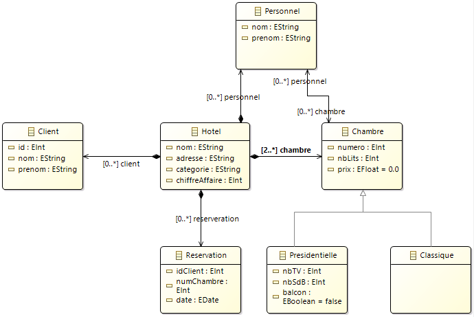

# IMT-CO-HotelReboot
Programme en ligne de commandes. Il s'éxecute avec Java JDK 16 sur Eclipse Modeling Tools avec ecore et xmi.
Il permet de faire la gestion d'hotels, on peut Créer, Lire, Mettre à jour et Supprimer des Hotels, Clients, Personnels, Chambres et Réservations.
Le programme ne prend pas en compte les cas d'erreurs, il se base sur le principe que l'utilisateur rentre les bonnes valeurs.
Les données rentrées sont enregistrées au format .xmi, on peut ensuite lire le fichier xmi ultérieurement pour modifier les données.



Chaque classe est dépendante de la classe Hotel. Le Personnel peut être affecté à plusieurs chambres, une Chambre peut être affectée à plusieurs Personnels.
La classe Réservation contient l'ID d'un Personnel existant et le numéro d'une chambre existante. Une Chambre peut être Classique ou Présidentielle.
Un Hotel a au moins deux chambres.

```
Lorsque vous lancez le programme, des choix seront affichés avec un nombre les préfixant. Entrez le nombre de votre choix et faites "entrer" pour passer à l'étape suivante.

1 - charger un hotel : Charger un hotel depuis un fichier .xmi
2 - créer un hotel : Créer un nouvel hotel
3 - Quitter : Quitter l'application

---------[ RESERVATION ]----------
11 - Créer une RESERVATION
12 - Modifier une RESERVATION
13 - Supprimer une RESERVATION
14 - Afficher une RESERVATION
15 - Afficher toutes les RESERVATION

---------[ CHAMBRE ]----------
21 - Créer une CHAMBRE
22 - Modifier une CHAMBRE
23 - Supprimer une CHAMBRE
24 - Afficher une CHAMBRE
25 - Afficher toutes les CHAMBRE

---------[ PERSONNEL ]----------
31 - Créer un PERSONNEL
32 - Modifier un PERSONNEL
33 - Supprimer un PERSONNEL
34 - Afficher un PERSONNEL
35 - Afficher tout le PERSONNEL

---------[ CLIENT ]----------
41 - Créer un CLIENT
42 - Modifier un CLIENT
43 - Supprimer un CLIENT
44 - Afficher un CLIENT
45 - Afficher tous les CLIENT

5 - Quitter et enregistrer
```

# Known Issues
- Lors de l'ajout d'une réservation, les dates ne sont pas prises en compte et mises à null
- Lors de l'update/delete d'un Personnel, les chambres ne sont pas mises à jour
- Les cas d'erreurs ne sont pas pris en compte, le programme fonctionne en partant du principe que l'utilisateur rentre les bonnes valeurs
